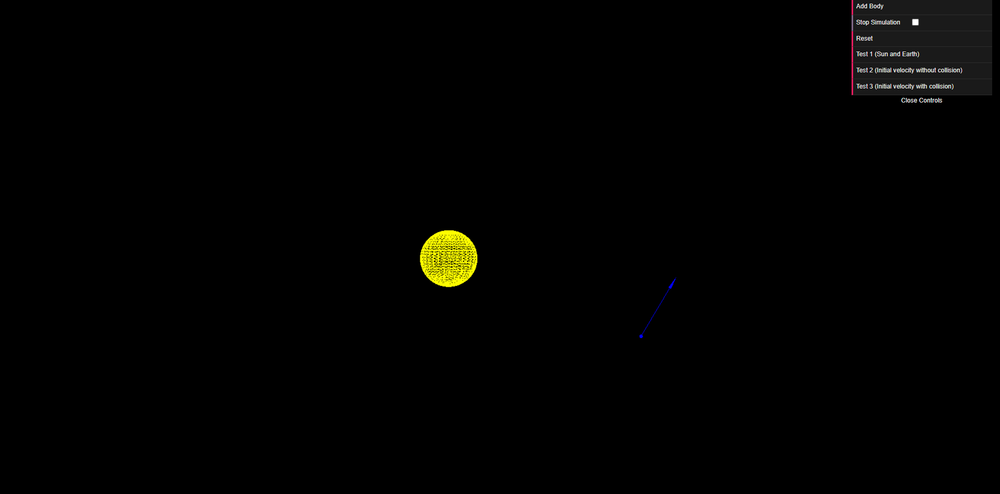
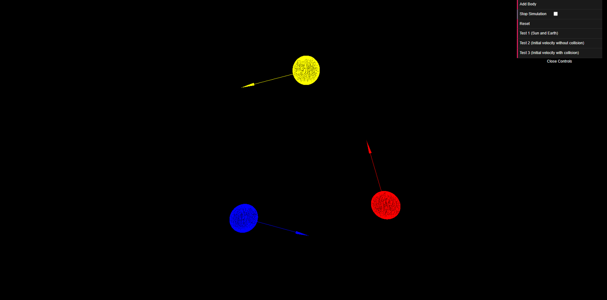
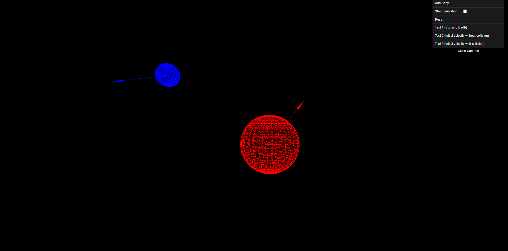

# Space_Z

Spase_Z is a Web app that allows users to explore the effects of gravity on different objects and planets in space.
Users can create their own scenarios or use predefined ones, and see how gravity influences the motion and interaction of the bodies.
Spase_Z is built with Webpack as a server, Three.js as a graphics library, and TypeScript as a programming language.

## How to run

1. First, you need to have [Node.js](https://nodejs.org/) and [npm](https://www.npmjs.com/) installed.
2. Install modules
    ```shell
    npm install
    ```
3. Run the dev script
    ```shell
    npm run dev
    ```
4. Enjoy!

## Screenshots








## Contributors

- Anas Shakaki [@ansshkki](https://github.com/ansshkki)
- Obada Al-Maleh [@obaa10](https://github.com/obaa10)

We welcome contributions to the Meqate project. If you have any ideas or suggestions, please feel free to open an issue or pull request.


